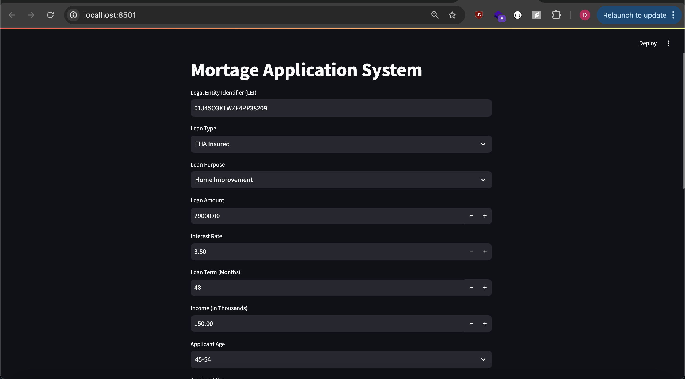
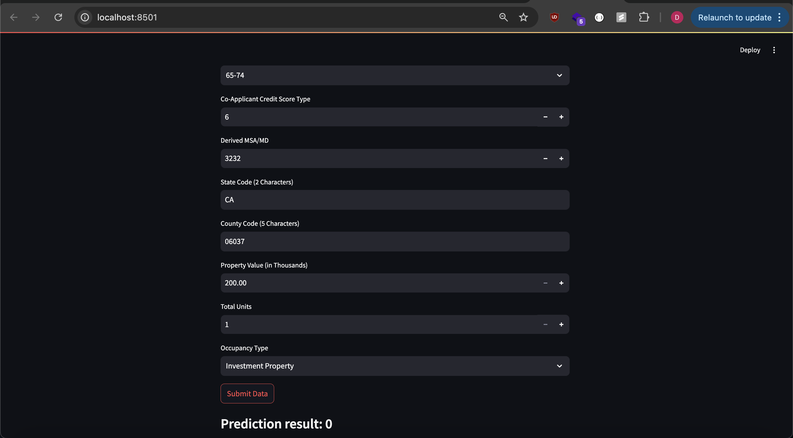
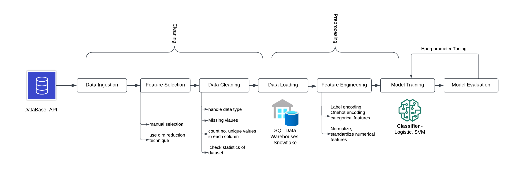

# Mortgage Approval Prediction System


\
\
\

\
It is a home loan approval prediction platform. It **predicts the decision** of home loan application based on **borrower's financial information, property information, geographic context, loan application details**, etc.

Below is the *diagram* of **ML pipeline** used to **train the model** for the platform. The pipeline was trained on **large-scale** (10GB) official 2020 U.S Home Mortgage Disclosure act(HMDA) dataset. And the **trained ML model** was integrated in web-application to make predictions.
## ML pipeline



## Stack

-   **Pyspark** framework was used to *make* the entire <ins>*pipeline*</ins>
-   **AWS EMR / GCP Dataproc cluster** of (1 Master machine and 3 Worker machines) was used as <ins>*compute*</ins> to train the pipeline
-   **AWS S3** was used as <ins>*datasource*</ins> and <ins>*warehouse*</ins>
-   **Streamlit** was used to make <ins>*web-app*</ins>


## Files Overview

**2020_lar.txt** - dataset file (~10GB and ~25M rows)

**Final-GCP.py** - contains Pyspark code to build ML pipeline that contains stage like Ingestion, cleaning, Preprocessing, Feature Engineering, Model training and Model evaluation which was run on GCP cluster

**models** - folder contains trained tranformer & ML models (trained on GCP cluster)

**app.py** - contains Web UI to make predicts from input fields

## Download and run

To run the application run the following commands
```
streamlit run app.py
```